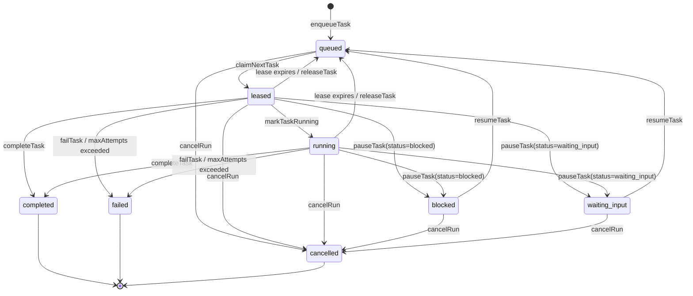

# Task and run lifecycle

This document is the authoritative picture of state in `@razroo/parallel-mcp`. If
the diagrams here disagree with the code, the code in
[`src/state-machine.ts`](../src/state-machine.ts) wins — please file a PR to fix
the docs.

## Task states

Key invariants:

- `completed`, `failed`, and `cancelled` are terminal. No transition leaves them.
- Every `queued -> leased` transition increments `attempt_count` atomically.
- Every `leased`/`running` task has a `lease_id`, `leased_by`, and
  `lease_expires_at`. Those three columns are cleared when the task leaves the
  leased/running states for any reason.
- A `not_before` is only set when a task is requeued by the retry path
  (`expireLeases`, `releaseTask` with retry configured). Fresh enqueues have
  `not_before = NULL`.

## Run status

Run status is **derived** from the statuses of the tasks in the run, plus the
run's own cancellation marker. It is recomputed after every task transition:

| Derived run status | Condition                                                                                  |
| ------------------ | ------------------------------------------------------------------------------------------ |
| `pending`          | No tasks yet                                                                               |
| `active`           | At least one task in `queued`, `leased`, or `running`                                      |
| `waiting`          | No active tasks, but at least one `blocked` or `waiting_input`                             |
| `completed`        | All tasks are `completed` or `cancelled`, and at least one is `completed`                  |
| `failed`           | No active/waiting tasks, and at least one `failed`                                         |
| `cancelled`        | Run was cancelled and no tasks are still `leased`/`running`, or all tasks are `cancelled`  |

`cancelRun` flips the run into `cancelled` immediately, but if any task is still
running/leased the derived status will stay `cancelled` on the run and flip back
only once those tasks leave those states.

## Event log

Every state change emits an append-only row in the `events` table and, if an
`onEvent` listener is registered, invokes it synchronously with the stored
record. The event types emitted today:

- `run.created`, `run.cancelled`, `run.status.changed`
- `task.enqueued`, `task.claimed`, `task.running`, `task.released`,
  `task.completed`, `task.failed`, `task.paused`, `task.resumed`,
  `task.lease_expired`, `task.heartbeat`
- `context_snapshot.appended`

Listener exceptions are swallowed so observability cannot break durable writes.
For reliable consumers, paginate `listEventsSince({ afterId, runId?, limit })`
and persist the returned `nextCursor`.
